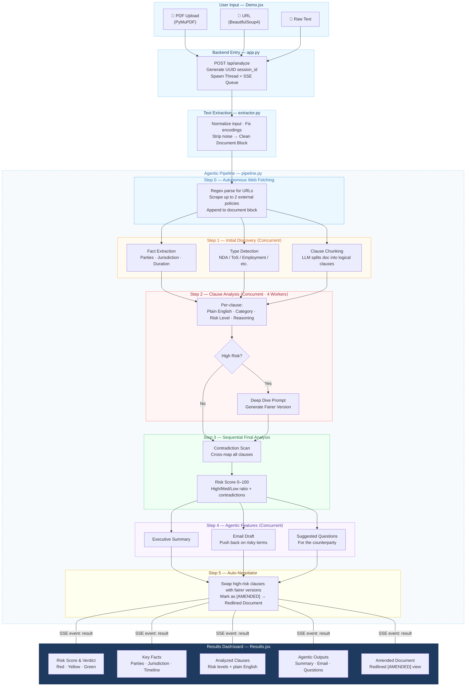

# Lexify: AI-Powered Legal Analyzer

### Project Documentation

**Demo Video:** [Watch the Demo](https://drive.google.com/file/d/1HegZr19Wxxu_YKWJ6yXr3rTDuFRTYgUk/view?usp=sharing)

> **Important Note on Prototype:** The Vercel deployment link does not have the backend running. However, a dev mock can be used to check how the interface works. For a complete demonstration of the full project working end-to-end, please refer to the demo video above.

---

## 1. Project Overview

Lexify is an intelligent, agentic legal document analyzer. It instantly processes legal documents (like NDAs, Terms of Service, Employment Contracts), identifies risk clauses, detects contradictions, assigns a risk score, and generates actionable outputs (like email drafts and suggested questions) and even redlines the document with fairer terms.

The project is structured as a full-stack application:

- **Frontend** — A sleek, animated React (Vite) application styled with Tailwind CSS and Framer Motion.
- **Backend** — A Python Flask server powered by the Groq API (utilizing Llama models) that orchestrates an asynchronous, highly concurrent "agentic pipeline" for document analysis.

---

## 2. Architecture & Tech Stack

### Frontend Stack

| Component  | Technology                             |
| ---------- | -------------------------------------- |
| Framework  | React.js built with Vite               |
| Styling    | Tailwind CSS                           |
| Animations | Framer Motion                          |
| Icons      | `@tabler/icons-react` & `lucide-react` |
| Routing    | React Router (`react-router-dom`)      |

### Backend Stack

| Component      | Technology                                                                      |
| -------------- | ------------------------------------------------------------------------------- |
| Framework      | Flask (Python) with `flask_cors`                                                |
| LLM Engine     | Groq API — `meta-llama/llama-4-scout-17b-16e-instruct` via `groq` python client |
| Concurrency    | `concurrent.futures.ThreadPoolExecutor`                                         |
| PDF Processing | PyMuPDF (`fitz`)                                                                |
| URL Scraping   | BeautifulSoup4                                                                  |

---

## 3. Frontend Deep Dive

The frontend is defined in the `frontend/` directory and is built around a clean, futuristic UI.

### Key Pages — `frontend/src/pages/`

**`Home.jsx`**
The landing page featuring a hero section ("Lexify - IT JUST WORKS") with flipping text animations (`LayoutTextFlip.jsx`) and a `DemoAnimation` on the side.

**`Demo.jsx`**
The main input portal.

- Accepts 3 types of input: File Upload (PDF), URL (scrapes the link), or Raw Text.
- On submission, it triggers the backend via a `POST` request.
- Displays a live "Terminal-style" execution log capturing Server-Sent Events (SSE) from the backend.
- Saves final results to `localStorage` (up to 10 historical items).

**`Results.jsx`**
A comprehensive dashboard displaying the backend's JSON output. Features include:

- **Risk Score & Verdict** — Visual cues (Red, Yellow, Green).
- **Key Facts** — Extracting parties, timeline, jurisdiction.
- **Analyzed Clauses** — An expandable list of identified clauses with their plain English translations and attached risk levels.
- **Agentic Outputs** — Exec summary, pre-written Email Drafts, and suggested follow-up questions.
- **Amended Document** — An option to view the document with high-risk clauses replaced by the LLM's suggested "fairer versions".

**`Presentation.jsx` & `AboutMe.jsx`**
Additional informative/slide viewing pages.

### Navigation

**`DynamicIsland.jsx`** — A universally accessible, floating top navigation bar that enables switching between Home, Demo, Presentation, and About sections.

---

## 4. Backend Deep Dive

The backend located in `backend/` orchestrates the AI logic.

### Endpoints — `app.py`

| Endpoint             | Description                                                                                                                               |
| -------------------- | ----------------------------------------------------------------------------------------------------------------------------------------- |
| `GET /api/health`    | Health check                                                                                                                              |
| `GET /api/test-groq` | Validates the connection to the Groq API                                                                                                  |
| `POST /api/analyze`  | Core endpoint. Generates a UUID `session_id`, uses a background `threading.Thread` and a `queue.Queue` to stream SSE back to the frontend |

### Text Extraction — `extractor.py`

Normalizes all inputs into a clean document block.

- **PDF Extraction** — Uses PyMuPDF. Extracts valid text and raises errors on purely scanned/image-based PDFs.
- **URL Extraction** — Uses `requests` and `BeautifulSoup`. Strips navbars, sidebars, cookie banners, scripts, and styles to get raw legal content.
- Text normalization targets formatting loops, fixes encodings, and removes excessive whitespace.

### Taxonomy — `taxonomy.py`

Defines the core risks based on document types (e.g., NDA risks vs. Rental Agreement risks). For example, an NDA targets fields like _Confidentiality Scope_, _Non-Compete_, and _Duration_.

### The Agentic Pipeline — `pipeline.py`

The pipeline heavily relies on concurrent execution (`ThreadPoolExecutor`) to offset LLM latency and avoid blocking.

**Step 0 — Autonomous Web Fetching ("The Rabbit Hole")**

- Regex parses the initial document for embedded hyperlinks.
- Scrapes up to 2 unique URLs to pull in external attached policies and appends them to the primary text block.

**Step 1 — Initial Discovery (Concurrent)**
The pipeline runs 3 tasks simultaneously:

1. **Fact Extraction** — Pulls key entities, jurisdictions, and durations.
2. **Type Detection** — Identifies if the document is an NDA, ToS, Employment Contract, etc.
3. **Clause Chunking** — Uses the LLM to break the large document into logical distinct clauses.

**Step 2 — Clause Analysis (Concurrent)**

- Loads the risk category via `taxonomy.py`.
- Iterates over every identified clause using a worker pool (up to 4 workers).
- For each clause, it determines: _Plain English Translation_, _Category_, _Risk Level_, and _Reasoning_.
- **Deep Dive Trigger** — If a clause scores "High Risk", the system automatically triggers a secondary prompt (`DEEP_DIVE_PROMPT`) to generate a "Fairer version" of the clause.

**Step 3 — Sequential Final Analysis**

- **Contradiction Scan** — Maps all clauses against each other to see if the document contradicts itself (e.g., Clause 2 says X, Clause 10 says NOT X).
- **Risk Score Calculation** — Computes an aggregate score out of 100 based on the ratio of high/medium/low risks and contradictions.

**Step 4 — Agentic Features (Concurrent)**
Generates three outputs simultaneously based on the full scope of analysis:

1. **Executive Summary**
2. **Email Draft** — Pushing back on specific terms.
3. **Suggested Questions** — For the user to ask the counterparty.

**Step 5 — Auto-Negotiator (Redline Generator)**

- Uses string replacement to swap out the highly risky original texts with the LLM-generated "Fairer version" marked with `[AMENDED]`, producing a ready-to-use redlined document.

---

## 5. Integration Flow — Frontend to Backend

1. User uploads a PDF/URL to `/demo`.
2. Frontend creates a `fetch` POST request with a streaming `TextDecoder` to handle SSE.
3. Backend `app.py` accepts the payload, extracts raw text, and triggers `run_pipeline()` in a background thread.
4. As `pipeline.py` executes each stage (e.g., "Analyzing clauses concurrently..."), it triggers a `progress_callback`.
5. `app.py` pushes these callbacks to the frontend via `yield "event: progress\ndata: ...\n\n"`.
6. Frontend updates the animated terminal log in real-time.
7. Upon completion, backend yields `event: result\ndata: {"document_type": ...}`.
8. Frontend stores data into `localStorage`, terminates the loading overlay, and redirects to `/results`, seeding the page with the final JSON object.

---

## 6. System Workflow Diagram

> **Reading the diagram** — Boxes grouped inside the dashed _Agentic Pipeline_ boundary represent stages executed by `pipeline.py`. Stages marked **⟨Concurrent⟩** run their child tasks simultaneously via `ThreadPoolExecutor`. The **SSE stream** carries real-time progress events back to the terminal log in `Demo.jsx` throughout pipeline execution, with the final `event: result` payload triggering the redirect to `Results.jsx`.
